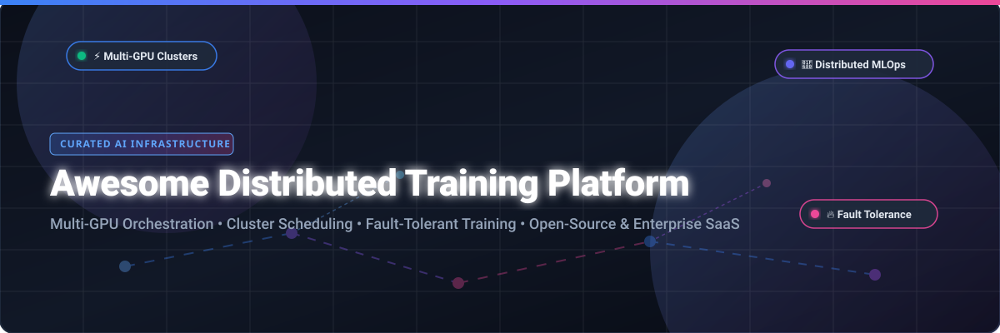

# 🚀 Awesome Distributed Training Platform



<a href="https://github.com/ishandutta2007/Awesome-Awesome-Awesome"></a><a href="https://discord.gg/jc4xtF58Ve"></a> [](https://github.com/ishandutta2007/Awesome-Distributed-Training-Platform) [](https://opensource.org/licenses/MIT) [](https://github.com/ishandutta2007/Awesome-Distributed-Training-Platform/pulls) <a href="https://github.com/ishandutta2007"></a>

> **A curated, SEO-optimized list of top SaaS products, cloud platforms, and open-source GitHub projects for Large-Scale Distributed Deep Learning, LLM Fine-Tuning, Multi-GPU Orchestration, and Cluster Scheduling.**

---

## 📑 Table of Contents
- [🌐 Sector Overview & Market Dynamics](#-sector-overview--market-dynamics)
- [☁️ SaaS & Hosted Enterprise Platforms](#-saas--hosted-enterprise-platforms)
- [💻 Open-Source GitHub Repositories](#-open-source-github-repositories)
- [🛠️ Distributed Training Framework Selection Matrix](#%EF%B8%8F-distributed-training-framework-selection-matrix)
- [🤝 How to Contribute](#-how-to-contribute)
- [💖 Support & Sponsorship](#-support--sponsorship)
- [📜 Disclaimer](#-disclaimer)
- [📈 Star History](#-star-history)

---

## 🌐 Sector Overview & Market Dynamics

> 📈 **Market Size & Growth Projection**: The global **Distributed AI Training & MLOps Infrastructure Market** is estimated at **\$18.5 Billion** and is projected to surpass **\$85.0 Billion** by 2032, expanding at a compound annual growth rate (CAGR) of **~32.4%**.

> 🧩 **Market Fragmentation & Competitive Dynamics**: The sector is **moderately to highly fragmented**. While hyperscale public cloud providers (AWS, Microsoft Azure, Google Cloud) hold dominant infrastructure shares for basic compute provision, specialized ML orchestration and bare-metal GPU platforms (such as Determined AI, Ray/Anyscale, Modal, Lambda Cloud, and Run:ai) thrive rapidly. This fragmentation is driven by enterprise demands for multi-cloud independence, microsecond inter-GPU interconnects (Infiniband/NVLink), custom workload scheduling, and zero-egress pricing.

---

## ☁️ SaaS & Hosted Enterprise Platforms

The table below lists leading managed commercial platforms for distributed deep learning and cluster orchestration, sorted by **Company Scale (Valuation / Market Capitalization)** in descending order.

| 🏢 Product & Platform | 📝 Key Features & Capabilities | 💰 Starting Tier Pricing | 🎁 Free Tier / Free Trial Limits | 📊 Company Scale (Valuation / Market Cap) |
| :--- | :--- | :--- | :--- | :--- |
| **[Microsoft Azure ML Compute](https://azure.microsoft.com/en-us/products/machine-learning)** | Managed PyTorch distributed training clusters with `MASTER_ADDR` automation, Infiniband networking, and enterprise MLOps pipelines. | **$0.526 / GPU-hr** *(NC6s_v3 instance)* | **$200 free credits** (30-day trial) + 55+ services always free | **$3.10 Trillion** *(Market Cap)* |
| **[NVIDIA Run:ai](https://www.run.ai/)** | Workload virtualization and dynamic GPU fractioning engine for multi-node Kubernetes clusters (acquired by NVIDIA). | **$1.20 / GPU-hr** *(or ~$3,000/GPU/yr enterprise)* | **30-day Free Sandbox Trial** (4 GPU cluster quota) | **$3.00 Trillion** *(Market Cap - NVIDIA)* |
| **[AWS SageMaker Training](https://aws.amazon.com/sagemaker/)** | Managed distributed training with SageMaker Model Parallelism (SMP), managed Spot instances, and Elastic Fabric Adapter (EFA). | **$0.526 / GPU-hr** *(ml.g4dn.xlarge instance)* | **2 months free trial** (250 hours/mo ml.m5/ml.g4dn compute) | **$2.20 Trillion** *(Market Cap - Amazon)* |
| **[Google Vertex AI Training](https://cloud.google.com/vertex-ai)** | Unified GCP platform featuring Google Cloud TPU v4/v5e pod orchestration, Vizier hyperparameter tuning, and custom containers. | **$0.35 / GPU-hr** *(NVIDIA T4)* + $0.045/CPU-hr | **$300 free credits** for new GCP accounts (90-day validity) | **$2.10 Trillion** *(Market Cap - Alphabet)* |
| **[Databricks Mosaic AI](https://www.databricks.com/product/machine-learning)** | Unified data & AI platform powered by MosaicML for pre-training and fine-tuning foundation LLMs at scale. | **$0.07 / DBU** *(~$2.40 / GPU-hr A100)* | **14-day Free Trial** with full platform capabilities | **$43.0 Billion** *(Valuation)* |
| **[Determined AI](https://determined.ai/)** *(HPE)* | Enterprise deep learning suite with fault-tolerant job resumption, hyperparameter search (ASHA/PBT), and multi-GPU scheduling. | **$0.80 / GPU-hr** *(HPE ML Dev Env)* | **100% Free Open-Source Edition** (Unlimited self-hosted) | **$25.0 Billion** *(Market Cap - HPE)* |
| **[DigitalOcean Paperspace Gradient](https://www.paperspace.com/)** | Cloud GPU environment tailored for ML development with zero-setup Jupyter Notebooks and low-cost training clusters. | **$0.45 / GPU-hr** *(M4000/P5000)* or $8/mo Pro | **Free Notebook Tier** (Free M4000/P5000 GPUs, 6-hr session limit) | **$15.0 Billion** *(Market Cap - DigitalOcean)* |
| **[Lambda Cloud](https://lambdalabs.com/)** | High-performance GPU cloud provider offering bare-metal NVIDIA H100/A100 instances with zero data egress fees. | **$0.50 / GPU-hr** *(NVIDIA A10)* / $2.49/hr (H100) | **$10 promotional sign-up credit** for new accounts | **$12.0 Billion** *(Valuation)* |
| **[Weights & Biases](https://wandb.ai/)** | Industry standard experiment tracking, model evaluation registry, and hyperparameter optimization dashboard. | **$50 / user / month** *(Teams tier)* | **Free Personal Plan** (100 hrs tracking/mo + 100GB storage) | **$1.25 Billion** *(Valuation)* |
| **[Anyscale](https://www.anyscale.com/)** | Managed Ray enterprise platform featuring RayTurbo runtime, elastic cluster auto-scaling, and mid-epoch checkpoint recovery. | **$0.5682 / GPU-hr** *(NVIDIA T4)* / $0.0135/CPU-hr | **$100 free starting credit** for new developer accounts | **$1.00 Billion** *(Valuation)* |
| **[Domino Data Lab](https://www.dominodatalab.com/)** | Enterprise MLOps platform providing central governance, infrastructure orchestration, and reproducible AI research environments. | **$1.20 / compute-hr** *(Enterprise SaaS)* | **14-day Free Sandbox Trial** with allocated resources | **$1.00 Billion** *(Valuation)* |
| **[Lightning AI](https://lightning.ai/)** | Modular cloud developer platform from creators of PyTorch Lightning with persistent Studios and multi-node compute. | **$0.55 / GPU-hr** *(NVIDIA T4)* / $1.00 per credit | **~80 GPU hours equivalent** (22 free credits/mo forever) | **$500 Million** *(Valuation)* |
| **[Modal](https://modal.com/)** | Serverless GPU compute platform with sub-second container cold starts, multi-node `@clustered` RDMA execution, and per-second billing. | **$0.59 / GPU-hr** *(NVIDIA T4)* / $0.000043/CPU-sec | **$30 free compute credits every month** (up to 10 concurrent GPUs) | **$200 Million** *(Valuation)* |
| **[Saturn Cloud](https://saturncloud.io/)** | Data science and Python cloud platform with native Dask cluster scaling and interactive GPU Jupyter instances. | **$0.62 / GPU-hr** *(NVIDIA T4)* | **Free Plan: 30 hours/month compute** (includes 3 GPU hours) | **$50 Million** *(Valuation)* |
| **[Valohai](https://valohai.com/)** | MLOps platform emphasizing strict model provenance, automated pipeline orchestration, and multi-cloud execution. | **$250 / user / month** *(Scale plan)* | **14-day Free Trial** with full orchestration features | **$25 Million** *(Raised $13M)* |

---

## 💻 Open-Source GitHub Repositories

The open-source ecosystem provides foundational libraries for distributed execution, cluster orchestration, model parallelization, and hyperparameter optimization. Repositories below are sorted by **GitHub Stars_Count** in descending order.

| 📦 Repository & Project | ⭐ GitHub Popularity Stars_Badge | 🛠️ Primary Focus & Architecture | 📄 License |
| :--- | :--- | :--- | :--- |
| **[vLLM](https://github.com/vllm-project/vllm)** | [](https://github.com/vllm-project/vllm/stargazers) | High-throughput, memory-efficient LLM serving and distributed multi-GPU inference engine featuring PagedAttention. | Apache-2.0 |
| **[Ray](https://github.com/ray-project/ray)** | [](https://github.com/ray-project/ray/stargazers) | Universal distributed computing framework for Python; includes Ray Train, Ray Tune, and Ray Data powering OpenAI & Cohere workloads. | Apache-2.0 |
| **[DeepSpeed](https://github.com/microsoft/DeepSpeed)** | [](https://github.com/microsoft/DeepSpeed/stargazers) | Deep learning optimization library by Microsoft featuring ZeRO (Memory Optimization), 3D parallelism, and pipeline speedups. | Apache-2.0 |
| **[Colossal-AI](https://github.com/hpcaitech/ColossalAI)** | [](https://github.com/hpcaitech/ColossalAI/stargazers) | Unified multi-dimensional parallelism system (Tensor, Pipeline, Sequence & 3D Parallelism) for scaling giant AI models. | Apache-2.0 |
| **[PyTorch Lightning](https://github.com/Lightning-AI/pytorch-lightning)** | [](https://github.com/Lightning-AI/pytorch-lightning/stargazers) | Lightweight PyTorch wrapper that decouples science from boilerplate, automating multi-GPU/TPU distributed training loops. | Apache-2.0 |
| **[MLflow](https://github.com/mlflow/mlflow)** | [](https://github.com/mlflow/mlflow/stargazers) | Open-source platform for managing end-to-end ML lifecycles, including experiment tracking, model registry, and packaging. | Apache-2.0 |
| **[Megatron-LM](https://github.com/NVIDIA/Megatron-LM)** | [](https://github.com/NVIDIA/Megatron-LM/stargazers) | NVIDIA's ongoing research framework for large-scale transformer model training using tensor and pipeline GPU parallelism. | Shell / Custom |
| **[Kubeflow](https://github.com/kubeflow/kubeflow)** | [](https://github.com/kubeflow/kubeflow/stargazers) | Native Kubernetes ML toolkit providing workflow pipelines, Katib hyperparameter tuning, and containerized job operators. | Apache-2.0 |
| **[Optuna](https://github.com/optuna/optuna)** | [](https://github.com/optuna/optuna/stargazers) | Automatic hyperparameter optimization framework featuring define-by-run search spaces and distributed pruning. | MIT |
| **[Horovod](https://github.com/horovod/horovod)** | [](https://github.com/horovod/horovod/stargazers) | Distributed deep learning training framework for PyTorch, TensorFlow, and Keras utilizing Ring-Allreduce ring architectures. | Apache-2.0 |
| **[Accelerate](https://github.com/huggingface/accelerate)** | [](https://github.com/huggingface/accelerate/stargazers) | Hugging Face library enabling PyTorch code execution across multi-GPU, TPU, DeepSpeed, and FSDP setups with minimal code edits. | Apache-2.0 |
| **[ClearML](https://github.com/allegroai/clearml)** | [](https://github.com/allegroai/clearml/stargazers) | Open-source MLOps suite integrating experiment tracking, GPU cluster agent scheduling, and dataset versioning. | Apache-2.0 |
| **[Composer](https://github.com/mosaicml/composer)** | [](https://github.com/mosaicml/composer/stargazers) | Open-source library by MosaicML for fast neural network training, incorporating 24+ efficiency methods and distributed speedups. | Apache-2.0 |
| **[FairScale](https://github.com/facebookresearch/fairscale)** | [](https://github.com/facebookresearch/fairscale/stargazers) | Meta AI research library for high-performance PyTorch distributed training (Fully Sharded Data Parallel / FSDP predecessors). | BSD-3-Clause |
| **[Determined](https://github.com/determined-ai/determined)** | [](https://github.com/determined-ai/determined/stargazers) | Full open-source deep learning platform featuring GPU cluster scheduling, automated checkpointing, and distributed HPO. | Apache-2.0 |
| **[KubeRay](https://github.com/ray-project/kuberay)** | [](https://github.com/ray-project/kuberay/stargazers) | Official Kubernetes operator for managing Ray clusters, handling RayCluster, RayJob, and RayService custom resource definitions. | Apache-2.0 |
| **[Kubeflow Training Operator](https://github.com/kubeflow/training-operator)** | [](https://github.com/kubeflow/training-operator/stargazers) | Kubernetes CRD operator for distributed training jobs across PyTorch (`PyTorchJob`), TensorFlow, XGBoost, and MPI. | Apache-2.0 |

---

## 🛠️ Distributed Training Framework Selection Matrix

```
                      +------------------------------------------+
                      |   What is your primary infrastructure?   |
                      +------------------------------------------+
                                           |
                  +------------------------+------------------------+
                  |                                                 |
         [ Cloud Kubernetes ]                               [ Bare-Metal / Cloud VMs ]
                  |                                                 |
        +---------+---------+                             +---------+---------+
        |                   |                             |                   |
  [ KubeNative Operator ] [ Python Distributed ]    [ Full Open Platform ]  [ High-Perf Parallel ]
        |                   |                             |                   |
        v                   v                             v                   v
    Kubeflow             KubeRay                       Determined           DeepSpeed /
 (Training Operator)   (Ray Train)                     (HPE ML)            Colossal-AI
```

---

## 🤝 How to Contribute

Contributions are welcome! Please follow these steps to add new tools or update existing records:

1. 🍴 **Fork the Repository**.
2. ✍️ **Update Data**: Modify `README.md` maintaining table formatting, specific pricing rates, and verified free tier limits.
3. 🔗 **Include Links**: Ensure GitHub repos include official Stars_Badges linking to the `/stargazers` page.
4. 🚀 **Submit a Pull Request** with a clear title and brief rationale.

---

## 💖 Support & Sponsorship

Thank you for exploring **Awesome Distributed Training Platform**! If you find this resource valuable for your AI projects, research, or infrastructure design, please consider showing your support:

- ⭐ **Star this Repository**: Helps increase visibility for developers and researchers.
- 🍴 **Fork & Share**: Share it with fellow ML engineers and platform teams.
- ☕ **Sponsor the Developer**: Support ongoing maintenance and curated ecosystem updates via [GitHub Sponsors](https://github.com/sponsors/ishandutta2007).

<p align="left">
  <a href="https://github.com/sponsors/ishandutta2007">
    
  </a>
</p>

---

## 📜 Disclaimer

- **Community Curated**: This repository is a community-maintained curated list and does not constitute an explicit endorsement of listed vendors.
- **Compliance & Security**: Distributed training operations handling proprietary datasets or LLM weights must ensure adherence to data sovereignty regulations (GDPR, HIPAA, SOC 2) and cloud export controls.
- **Infrastructure Overhead**: Self-hosted open-source clusters (e.g., Ray, Kubeflow, Determined) require active network engineering (RDMA/Infiniband setup, shared POSIX/S3 checkpoint stores) and security hardening.

---

## 📈 Star History

[](https://star-history.dera.page/#ishandutta2007/Awesome-Distributed-Training-Platform&type=date&legend=top-left)

---

<p align="center">
  <b>Built with ❤️ for ML Engineers, Platform Teams, and AI Researchers worldwide.</b>
</p>
